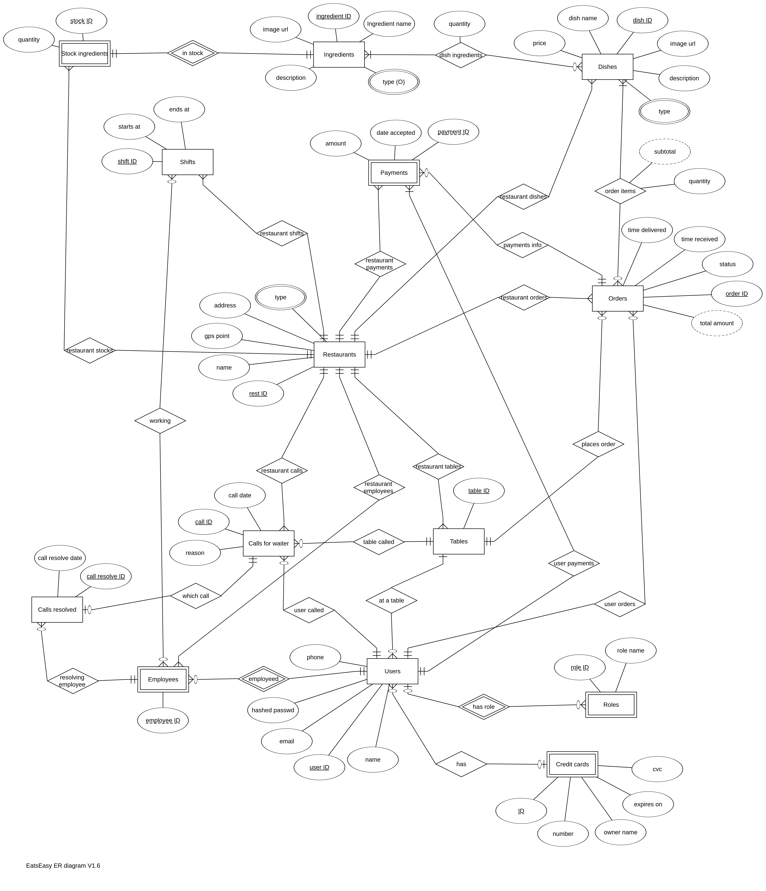
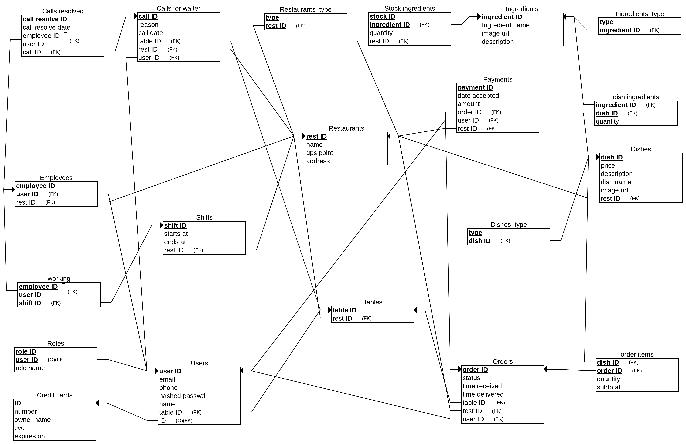
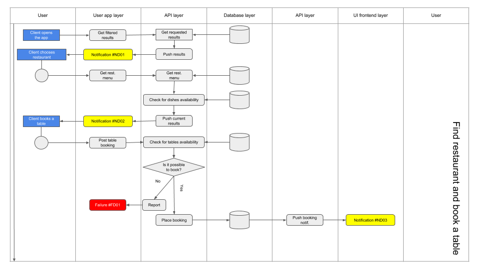
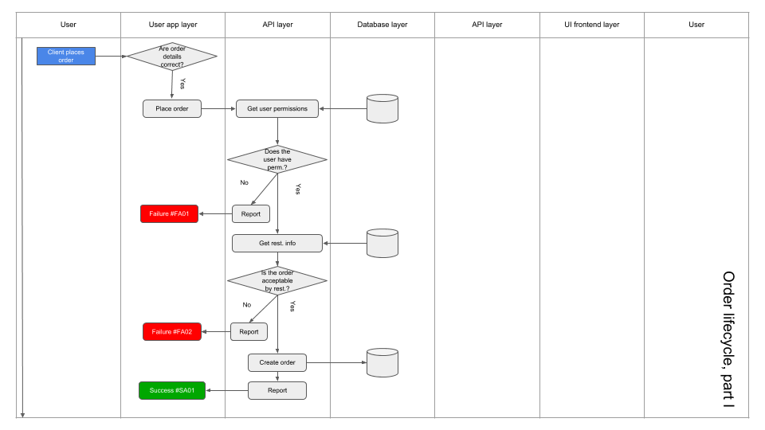
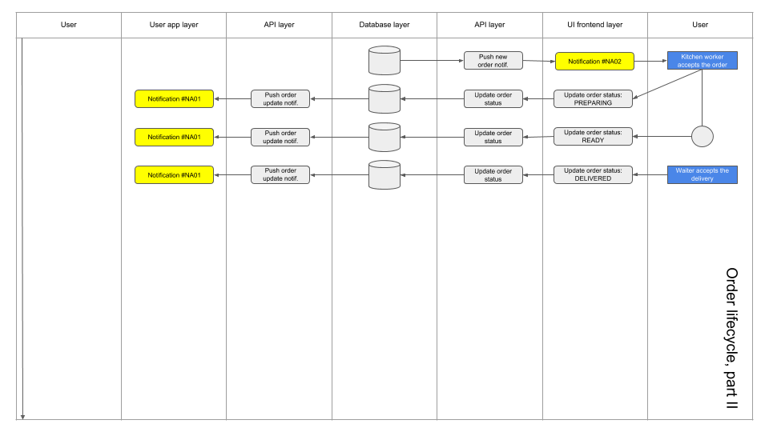
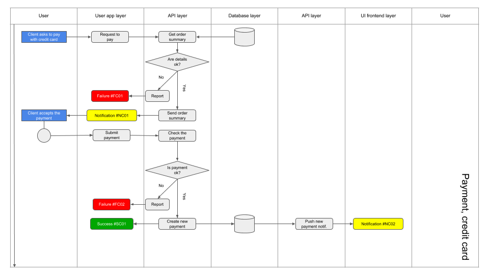
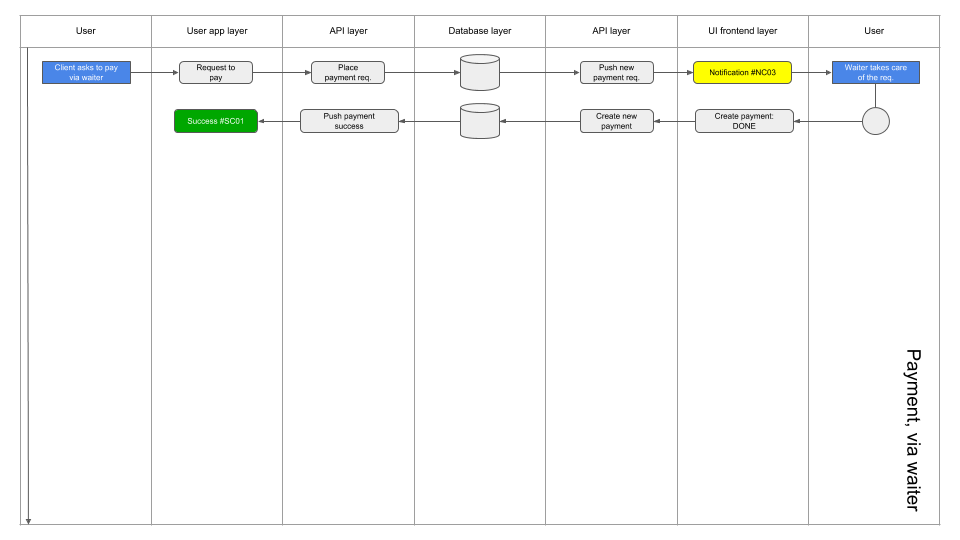
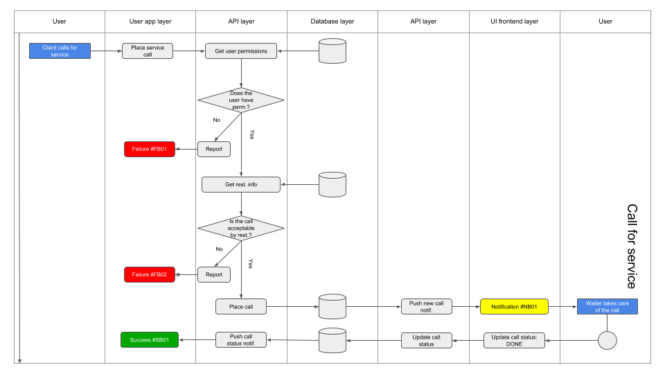
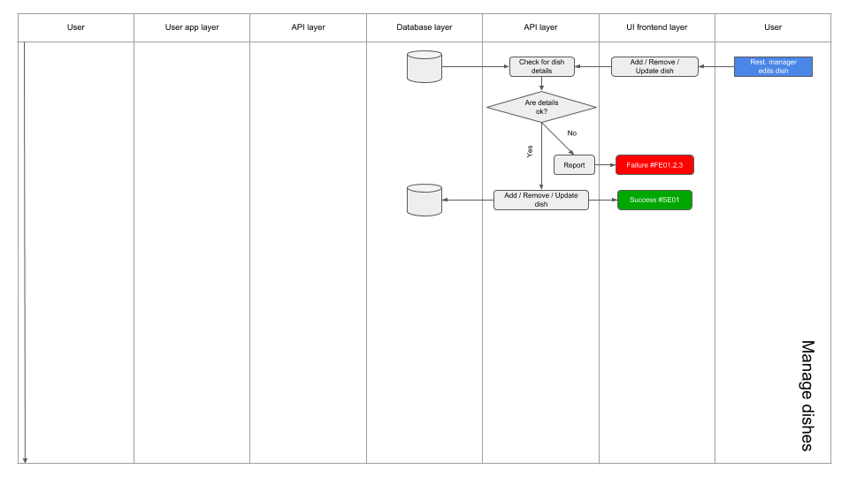
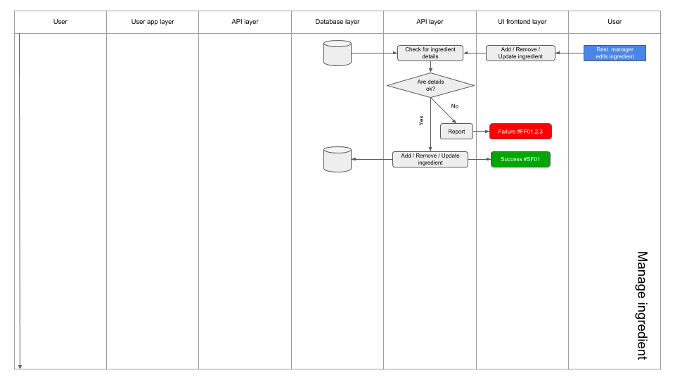

# System Design Document

### 0. Overview

The System Design Document describes the system requirements, operating environment, system and subsystem architecture, files and database design, input formats, output layouts, human-machine interfaces, detailed design, processing logic, and external interfaces.

### 1. INTRODUCTION

#### 1.1 Purpose and Scope

This Software Design Description (SDD) describes the detailed structure of the components of the Eats Easy system that connects clients and restaurants, and the precise implementation details required to satisfy the requirements as specificted in the Project Proposal Document (PPD). It is assumed that the reader has read the PPD, since this document also defines the implementation details of the desired behaviour given the requirements within it.

#### 1.2 Project Executive Summary

The Goal of the project is to design and develop an easy-to-use system that helps people find tasty food, near their location and according to their tastes. 

The documentation, development and testing processes shall end before February 2019. 

Project milestones:

- High-level design
- Proposal and Design documentation
- Server (API) development
- Eaters and Staff User Interface (UI) development
- Alpha + Testing
- Beta + Testing
- API documentation
- Web page, production deployment etc.

Nearly all of technologies that are going to be used in the Project are new for the team. The learning curve may lead to a risk in having a fully working starting setup on time. Another risk is the fact that all team members are partly "employed" in this project, which also may lead to other delays in deployment of milestones' versions. 

Project's mitigation/enhancement plan is to reduce the unnecessary parts of the Project to a minimum and to concentrate on the main/core parts of the System up to the Testing phase. 

In the future, the System will be ready for next stage development up to the stage where it can be used by actual clients.

#### 1.2.1 System Overview

The Eats Easy is a system that helps its clients to find a place that offers the food they want fast and easy. It also allows to book a table, order a take-away or sit-inside without physically being and/or interacting with restaurant staff. 
The system consists of a Remote Main Server (hosted at Heroku for this moment), the Eaters App and the Staff App. 

#### 1.2.2 Design Constraints

The project does not have any constraints or conflicts with other system due to its standalone-ness and self-sufficiency.

#### 1.2.3 Future Contingencies

In next stages of development some independent services and APIs may be involved, such as network security service using SSL, payment services' APIs, map and advertising APIs and more. All these are irrelevant for current projectal stage, whose design is described in this document.

#### 1.3 Document Organization

This document describes the design of each part of the system, what it does, how every part is connected, what the action flows the system have etc.

#### 1.4 Points of Contact

The management, design, documentation, development, configuration, quality assurance and integration team consists of these members:

- Ron Yanku ([Github](https://github.com/ronyanku))
- Felix Razikov ([Github](https://github.com/guzzur))

#### 1.5 Project References

- This document is based on the original System Design Document template ([Link](https://docs.google.com/document/d/1o749kKtnEzWJrZNkag9w3uHShTiQ9mEk6jeEGTmcTgY/edit?usp=sharing))
- Documentation repository ([Github](https://github.com/eats-easy/eats-easy-doc))
  - Project Proposal Document ([Link](eats-easy-proposal.pdf))
  - Flow Charts Document ([Link](eats-easy-flow-charts.pdf))
  - Application Program Interface (API) Description Document ([Link](application-program0interface.md))
- Main Server repository ([Github](https://github.com/eats-easy/eats-easy-spring))
- Eaters App repository ([Github](https://github.com/eats-easy/eats-easy-eaters))
- Staff App repository ([Github](https://github.com/eats-easy/eats-easy-staff))

#### 1.6 Glossary

- API - Application Program Interface
- Eaters - clients who use the system to find food
- Staff - clients who use the system to serve food

### 2. SYSTEM ARCHITECTURE

#### 2.1 System Hardware Architecture

#### 2.2 System Software Architecture

- Java Spring Boot based REST API server and microservices [backend]
  - Spring MVC (Spring's contender of JSF)
  - Tomcat Java Servlet
  - Maven Dependency Manager
  - JavaBeans functionality
  - PostgreSQL for our Relational Database
  - XML configuration
- Android app with React Native for the eater [frontend]
- Android app with React Native for the staff [frontend]

#### 2.3 Internal Communications Architecture

All internal communication is REST based and it is be described in the [API documentation](application-program-interface.md) for each version, once it is deployed.

### 3. FILE AND DATABASE DESIGN

Data dictionary:

- C - Create
- R - Read
- U - Update
- D - Delete

#### 3.1 Database Management System Files

We use PosgreSQL (through Heroku) for our Database

##### Users' data access\*:

| Table name        | Eaters | Staff |
| ----------------- | ------ | ----- |
| Ingredients       | R      | CRUD  |
| Restaurants       | R      | RU    |
| Credit cards      | CRUD   |       |
| Ingredients type  | R      | R     |
| Restaurants type  | R      | R     |
| Dishes            | R      | CRUD  |
| Tables            | R      | CRUD  |
| Shifts            |        | CRUD  |
| Stock ingredients |        | CRUD  |
| Users             | CRUD   | R     |
| Roles             |        | CRUD  |
| Dish ingredients  | R      | CRUD  |
| Dishes type       | R      | CRUD  |
| Employees         |        | CRUD  |
| Orders            | CRUD   | RU    |
| Calls for waiter  | CRUD   | RUD   |
| Payments          | CRUD   | R     |
| Calls resolved    | R      | CRUD  |
| Order items       | CRUD   | CRUD  |
| Working           |        | CRUD  |

---

\* - additional access check per item may apply

---

##### Entity Relationship Diagram (ERD) ([enlarge](images/eats-easy-erd-v1.6.png))

##### Relational Schema (RS) ([enlarge](images/eats-easy-rs-v1.6.png))

#### 3.2 Non-Database Management System Files

- **Logs** - log files will be written on the Java Spring Server and stored as local. Every month (or when data size quota is exceeded) the oldest files will be deleted. Only users connected to the machine (container) will be able to read/write/delete these files manually and only for debugging purposes
- **Images** - dishes' pictures as well as restaurant exterior and interior pictures will be stored at the Server too. Each request for restaurant and/or dish will supply a global URL to the file which is stored in folder with public access

### 4. HUMAN-MACHINE INTERFACE

#### 4.1 Inputs/outputs

##### An eater can interact with the system using the following GUI:

1. Restaurant search screen – this is the starting eater screen, where he can search for a particular restaurant, either by using it's full name, or by searching for restaurants through a particular filter, for instance he could search for all restaurants with a Japanese cuisine

2. Restaurant info screen – after choosing a restaurant the user is presented with a screen that gives him information about the restaurant, including a menu and an option to reserve a table assuming there are available tables in real time

3. "While at restaurant" screen – this is the screen the eater sees after making a reservation. Here he is presented with the following buttons:

   - "Place an order" - leads to another screen
   - "Payment" - leads to another screen
   - "Call a waiter" - registers a call in the DB and the restaurant workers UI. In addition after placing an order, the items ordered are presented in this screen

4. Order placement screen – the user sees this when he presses the "Place an order" button, he gets a screen with the menu and can add items to his order and click "Place order" when he is finished

5. Payment screen – the user sees this when he presses the "Pay" button, he is then prompted with a screen asking him for the relevant payment information

##### A restaurant worker can interact with the app using the following GUI:

1. Open orders screen – in this screen the workers can see the open orders and update their status. When the chef presses the "ready" button, the status of the order changes from "in preparation" to "ready". Then a waiter would deliver the order to the eater and press the "delivered" button, changing the order status to "delivered". After the eater pays for his meal, the order would disappear from this screen.

2. Open calls screen - in this screen the worker is able to browse all the calls for service that have been openned by eaters and update their statuses after changes are done

3. Edit menu screen – here a worker (with the right permission) can add or remove dishes from the menu.

### 5. DETAILED DESIGN

This section provides the information needed for a system development team to actually build and integrate the hardware components, code and integrate the software modules, and interconnect the hardware and software segments into a functional product. Additionally, this section addresses the detailed procedures for combining separate packages into a single system.

#### 5.1 Hardware Detailed Design

The system is not using any hardware owned by Eats Easy team. The Main Server and the Database is hosted at Heroku Applications Hosting Service and the Eaters and Staff Apps will run on the Android Smartphones and/or Tablets owned by clients. 

In order to succesfully run the Main Server, the application hosting service servers shall have these (or higher) abilities/details:

- Run Linux kernel v2.4 or its MS Windows equivalent
- Have JDK 11 installed
- Have the automatic "on push" build and deploy ability
- Have an authorized connection to the Github project's repositories
- Run Postgres Database Server V4.0
- Have proper ports enabled for accepting HTTP requests

For a local development and/or testing, any computer with similar characteristics is required. 

In order to succesfully run the clients' Apps, the Smartphone/Tablet shall have these (or higher) abilities/details:

- Have a proper internet connection (cellular or Wi-Fi)
- Run V4.0+ Android Operating System
- Have at least 1GB of RAM (Random Access Memory)
- Have a non-potato processor
- Have a screen resolution of 1280\*720 pixels or higher
- Have a functional touch and drag screen

#### 5.2 Action/logic flow

Signs used in this section:

##### Find restaurant

##### Order lifecycle, part I

##### Order lifecycle, part II

##### Payment - credit card

##### Payment - via waiter (cash or credit card)

##### Call for service

##### Manage dishes

##### Manage ingredients

### 6. EXTERNAL INTERFACES

#### 6.1 Interface Architecture

All external communication is REST based and it is described in the [API documentation](application-program-interface.md) for each version, once it is deployed.

### 7. SYSTEM INTEGRITY CONTROLS

Developers of sensitive State systems are required to develop specifications for the following minimum levels of control:

- Internal security to restrict access of critical data items to only those access types required by users (passwords, credit cards, personal information etc.)
- Standard Tables to be used or requested for validating data fields
- Verification processes for additions, deletions, or updates of critical data
- Ability to identify all audit information by user identification, network terminal identification, date, time, and data accessed or changed
